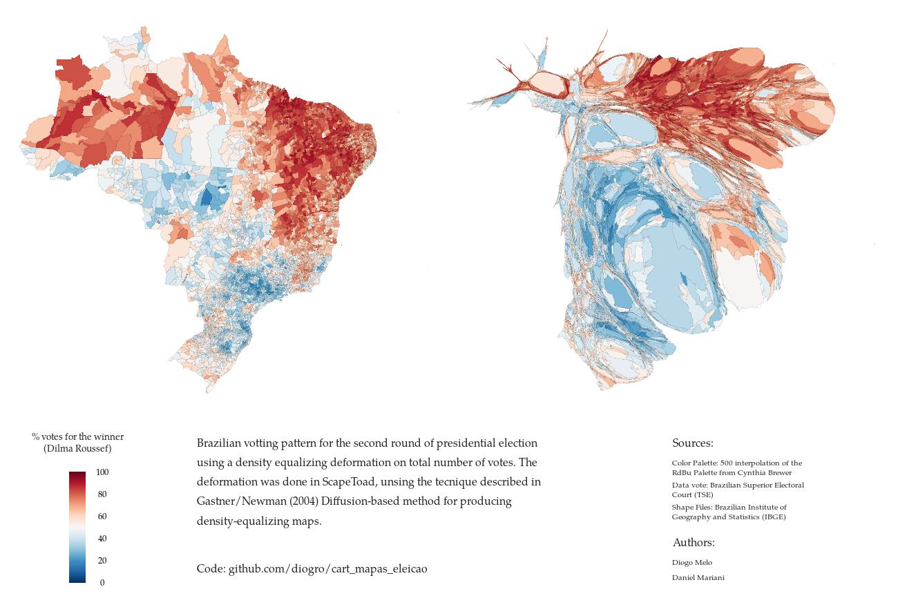

Brazilian votting pattern for the second round of presidential election using a density equalizing deformation on total number of votes. The deformation was done in [ScapeToad](http://scapetoad.choros.ch/), unsing the tecnique described in [ Gastner/Newman (2004) Diffusion-based method for producing density-equalizing maps](http://www.pnas.org/content/101/20/7499.full)

